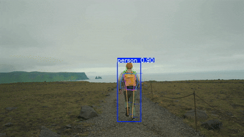

# Basketball Journey - AI Pose Estimation



This project uses the YOLOv8 pose estimation model to detect and track human body keypoints in real-time from a webcam, a video file, or a static image. It's designed to be a foundational tool for analyzing movement, such as a basketball player's shooting form.

---

### 📝 My Blog Post

I wrote a detailed article about the development process and the technology behind this project. You can read it here:

- **[Read the full blog post](https://your-blog-link-here.com)**

### 🎥 YouTube Demo

Watch the project in action! I've uploaded a video demonstrating the real-time pose tracking and analysis features.

- **[Watch the YouTube video](https://www.youtube.com/watch?v=your-video-id)**

---

## Features

- **Real-Time Webcam Analysis**: Tracks your pose directly from your webcam.
- **Video File Analysis**: Processes a pre-recorded video to detect poses and saves the output as a new video file.
- **Image Analysis**: Analyzes a static image and saves a new image with the pose overlay.
- **Modular Code**: Easy-to-understand functions for pose detection and keypoint labeling.

## Setup

1.  **Clone the repository:**
    ```bash
    git clone https://github.com/KeeganFernandesWork/Basketball-Journey.git
    cd Basketball-Journey
    ```

2.  **Install the required Python packages:**
    It's recommended to use a virtual environment.
    ```bash
    pip install -r requirements.txt
    ```
    *(Note: You will need to create a `requirements.txt` file. Based on your code, it should contain `opencv-python` and `ultralytics`.)*

3.  **Download the model:**
    The `yolov8n-pose.pt` model file is required and should be in the same directory as the scripts.

## How to Use

There are three ways to run this project:

### 1. Real-Time Webcam Pose Estimation

To run the pose estimation on your live webcam feed, execute the following command:

```bash
python main.py
```
Press `q` to exit the live feed.

### 2. Analyze a Video File

To process a video file from your computer, run:

```bash
python video_analyzer.py
```
A file dialog will open for you to select a video. The processed video will be saved as `your_video_name_output.mp4`.

### 3. Analyze an Image File

To process a static image, run:

```bash
python image_analyzer.py
```
A file dialog will open for you to select an image. The output will be saved as `your_image_name_output.jpg` (or the original extension).

---

Feel free to fork this repository and expand on it!
